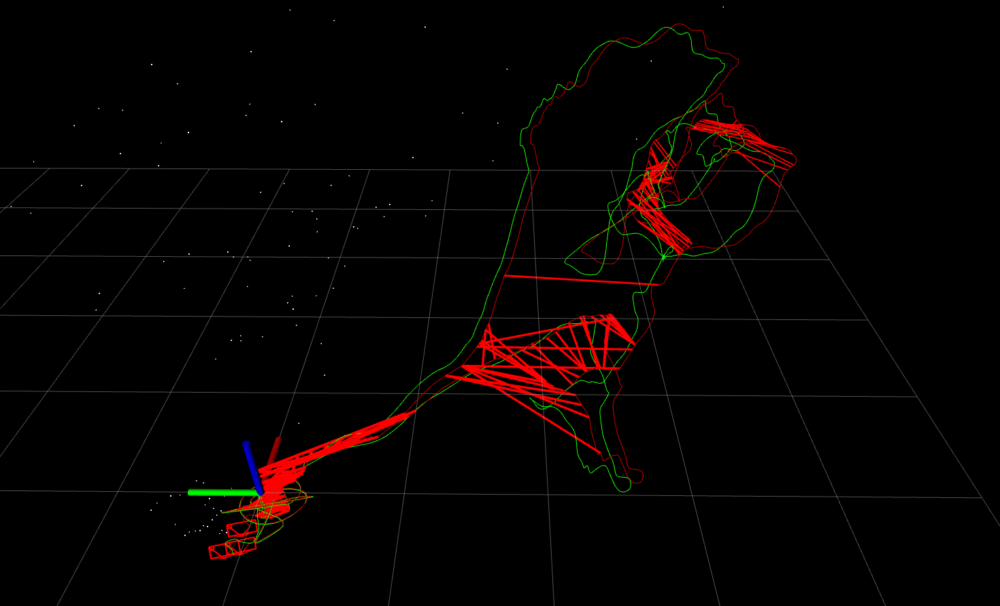
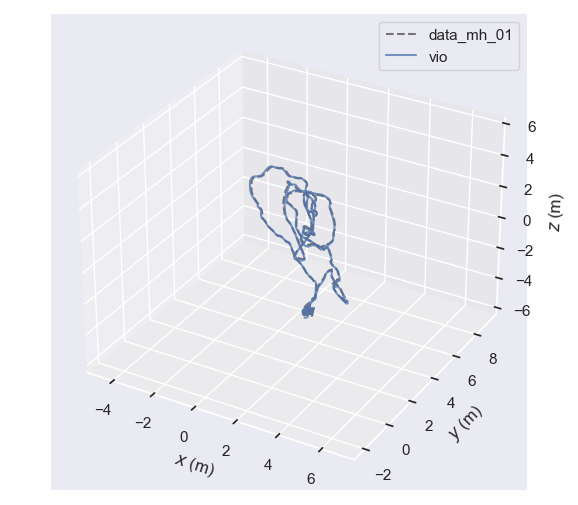
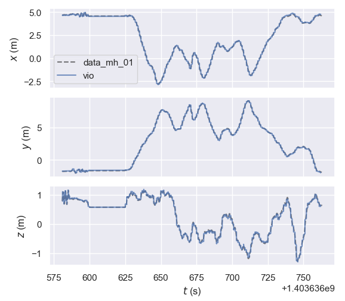
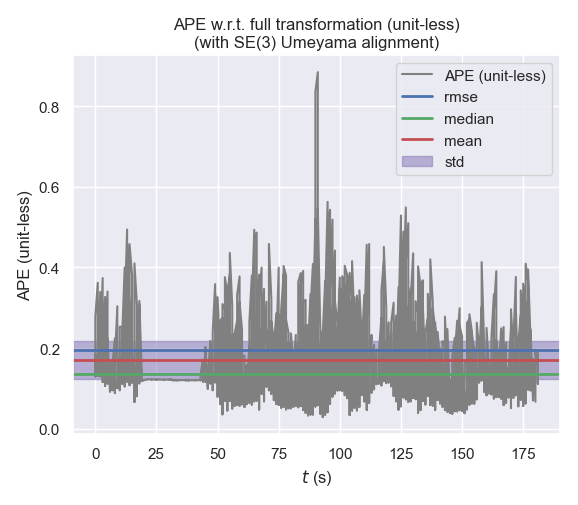
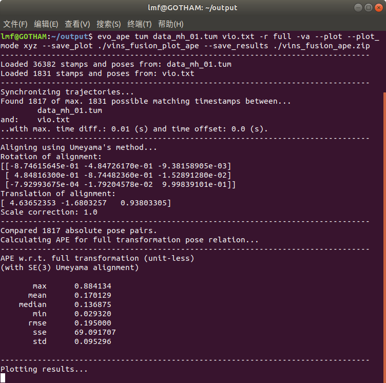
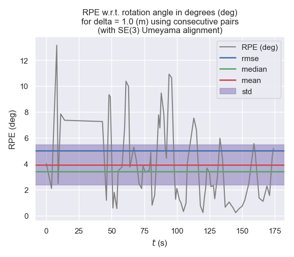
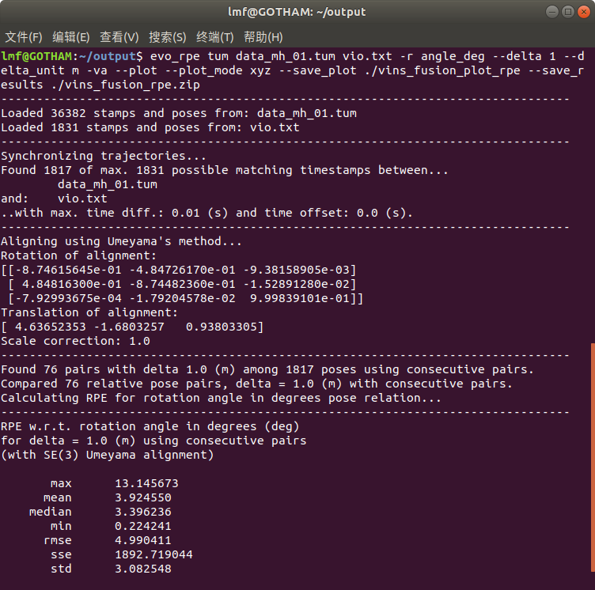
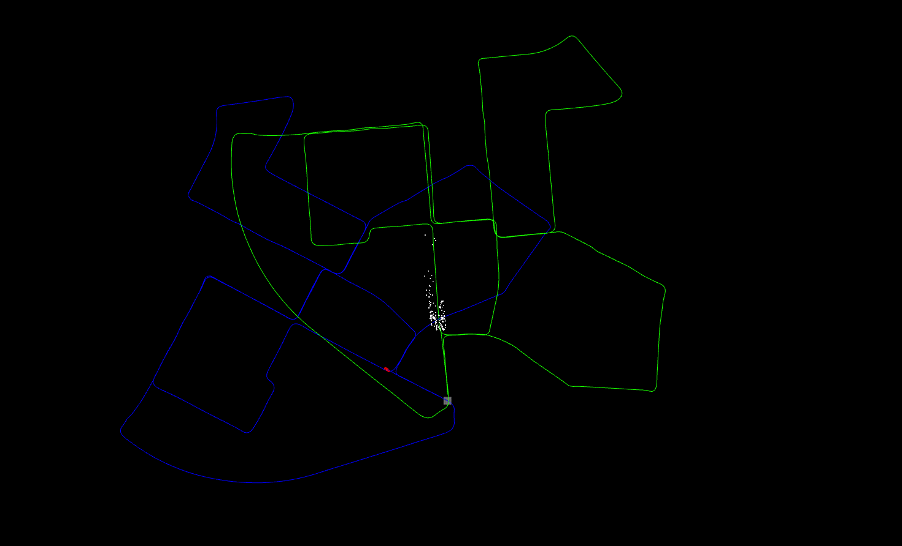

# VINS-Fusion-GPU-BA
This repository is a version of [VINS-Fusion](https://github.com/HKUST-Aerial-Robotics/VINS-Fusion) with a CUDA reimplementation of Bundle Adjustment.

Modifications are as follow : 
- The codes of Bundle Adjustment reimplementation are in [vins_estimator/src/cuda_bundle_adjustment](https://github.com/qdLMF/VINS-Fusion-CUDA-BA/tree/master/vins_estimator/src/cuda_bundle_adjustment).
- Estimator::optimization() in estimator.cpp is rewritten as follow :
```
void Estimator::optimization() {
    if(frame_count == WINDOW_SIZE) {
        optimization_with_cuda();  // solve and marginalize with cuda when the sliding window is full
    } else {
        optimization_with_ceres(); // solve with ceres when the sliding window is not yet full
    }
}
```

## Dependencies
The essential software environment is as same as [VINS-Fusion](https://github.com/HKUST-Aerial-Robotics/VINS-Fusion). 

While the Bundle Adjustment in estimator.cpp is reimplemented with CUDA and Eigen, this repository still requires [ceres solver](http://ceres-solver.org/) for non-linear optimization for : 

- Bundle Adjustment in estimator.cpp before frame_count turn to WINDOW_SIZE
- GlobalSFM::construct() in initial_sfm.cpp
- PoseGraph::optimize4DoF() in pose_graph.cpp.

Meanwhile, the CUDA reimplementation of Bundle Adjustment in estimator.cpp requires :

- C++14

- [CUDA](https://developer.nvidia.com/cuda-downloads) (>= 11.0)

- CUBLAS

- CUSOLVER

- [Eigen](https://eigen.tuxfamily.org/) (>= 3.3.9)


# How To Build
Before build this repo, some CMAKE variables in [vins_estimator/src/cuda_bundle_adjustment/CMakeLists.txt](https://github.com/qdLMF/VINS-Fusion-GPU-BA/blob/master/vins_estimator/src/cuda_bundle_adjustment/CMakeLists.txt) need to be modified to fit your enviroment : 
```
set(CMAKE_CUDA_COMPILER  /usr/local/cuda/bin/nvcc)		# set it to your path to nvcc
set(CUDA_TOOLKIT_ROOT_DIR  /usr/local/cuda/bin/nvcc)	# set it to your path to nvcc
set(CMAKE_CUDA_ARCHITECTURES  52)	# for example, if your device's compute capability is 6.2, then set it to 62
```

If your device's compute capability is >= 6.0, you can just change MyAtomicAdd() in [vins_estimator/src/cuda_bundle_adjustment/cuda_kernel_funcs/device_utils.cu](https://github.com/qdLMF/VINS-Fusion-GPU-BA/blob/master/vins_estimator/src/cuda_bundle_adjustment/cuda_kernel_funcs/device_utils.cu) into the following : 
```
template<typename T>
__device__ T MyAtomicAdd(T* address, T val) { return atomicAdd(address, val); }
```
Or, you can just replace MyAtomicAdd() with atomicAdd() wherever MyAtomicAdd() is called.

The basic steps to compile and run this repo is as same as [VINS-Fusion](https://github.com/HKUST-Aerial-Robotics/VINS-Fusion).


## Speed-up
<table style="display:table-cell;vertical-align:middle;text-align:center;">
<tr>
<th rowspan="2">Sequence</th><th colspan="3">CPU (Intel I7-6700K)</th><th>GPU (Nvidia 980TI)</th>
</tr>
<tr>
<th>iterations</th><th>solve</th><th>marginalization</th><th>solve<br>(at least 10 iterations)<br>& marginalization</th>
</tr>
<tr>
<td>MH_01_easy<br>WINDOW_SIZE == 10<br>max feature count == 150</td><td>5.73 no RVIZ<br>5.73 with RVIZ</td><td>61.17ms no RVIZ<br>74.74ms with RVIZ</td><td>12.25ms no RVIZ<br>21.21ms with RVIZ</td><td>29.38ms no RVIZ<br>37.39ms with RVIZ</td>
</tr>
<tr>
<td>MH_05_difficult<br>WINDOW_SIZE == 10<br>max feature count == 150</td><td>6.46 no RVIZ<br>6.46 with RVIZ</td><td>63.17ms no RVIZ<br>74.36ms with RVIZ</td><td>9.73ms no RVIZ<br>17.71ms with RVIZ</td><td>27.23ms no RVIZ<br>35.49ms with RVIZ</td>
</tr>
<tr>
<td>2011_10_03_drive_0027_sync<br>WINDOW_SIZE == 10<br>max feature count == 200</td><td>4.71 no RVIZ<br>4.70 with RVIZ</td><td>18.79ms no RVIZ<br>19.81ms with RVIZ</td><td>6.07ms no RVIZ<br>7.18ms with RVIZ</td><td>19.98ms no RVIZ<br>22.27ms with RVIZ</td>
</tr>
<tr>
<td>MH_01_easy<br>WINDOW_SIZE == 20<br>max feature count == 300</td><td>7.13 no RVIZ<br>7.13 with RVIZ</td><td>126.09ms no RVIZ<br>163.89ms with RVIZ</td><td>20.47ms no RVIZ<br>28.88ms with RVIZ</td><td>51.56ms no RVIZ<br>65.35ms with RVIZ</td>
</tr>
<tr>
<td>MH_05_difficult<br>WINDOW_SIZE == 20<br>max feature count == 300</td><td>6.61 no RVIZ<br>6.61 with RVIZ</td><td>103.50ms no RVIZ<br>137.44ms with RVIZ</td><td>15.66ms no RVIZ<br>23.88ms with RVIZ</td><td>45.66ms no RVIZ<br>58.60ms with RVIZ</td>
</tr>
<tr>
<td>2011_10_03_drive_0027_sync<br>WINDOW_SIZE == 20<br>max feature count == 400</td><td>4.94 no RVIZ<br>4.93 with RVIZ</td><td>44.14ms no RVIZ<br>46.91ms with RVIZ</td><td>9.22ms no RVIZ<br>11.99ms with RVIZ</td><td>34.18ms no RVIZ<br>38.40ms with RVIZ</td>
</tr>
</table>

Since the theoretical FP64 performance of Nvidia 980TI GPU (compute capability = 5.2) is only 189.4 GFLOPS, and atomicAdd() for FP64 is not available on devices with compute capability lower than 6.0, expecting a better speed-up with more recent hardwares is plausible.

P.S. It seems that RVIZ will largely slow down the speed of this reimplementation.


## Precision

MH_01_easy  (WINDOW_SIZE == 10, graphs are generated by [evo](https://github.com/MichaelGrupp/evo)) : 

<p align='center'>

</p>
<p align='center'>


</p>


<p align='center'>


</p>

<p align='center'>


</p>


KITTI 2011_10_03_drive_0027_sync : 
- WINDOW_SIZE is 10
- green path is generated by VO (estimator.cpp)
- blue path is generated by fusing VO with GPS (globalOpt.cpp)

<p align='center'>

</p>


## Some Implementation Details

Use Levenberg-Marquart to solve delta, at least 10 iterations.

Since the bottom right part (which corresponds to inverse depths) of the big hessian matrix is diagonal, a schur complement trick is used to solve the system states before solving the inverse depths

All jacobians, residuals, robust info matrices, hessian blocks, rhs blocks are computed on GPU.

No explicit big jacobian matrix and big residual vector is formed.

The big hessian matrix and rhs vector are formed this way : 

- Multiply tiny jacobian blocks and residual blocks to form tiny hessian blocks and rhs blocks inside kernel functions.
- Add tiny hessian blocks and rhs blocks to the big hessian and rhs by calling atomicAdd() inside kernel functions.

In the original implementation with Ceres, a eigen decomposition is done in the process of marginalization to form a MarginalizationFactor for the next frame. This is because ceres-1.14 has to use jacobians to form hessians, instead of just taking formed hessians from API. Ceres-1.14 will also evaluates the error of MarginalizationFactor at new linearization points as part of the iteration strategy. However, in this reimplemetation, we don't use ceres and we ignore the error of MarginalizationFactor (we still use new linearization points to update hessian prior and rhs prior), so we don't need the eigen decomposition of the hessian prior (which usually take about 5~6ms on my Nvidia 980TI GPU) in the process of marginalization.


## Limitations
Currently only support scenarios where the following conditions are all satisfied : 
- STEREO == true
- ESTIMATE_TD == false
- ESTIMATE_EXTRINSIC == false

Data type must be FP64. A version with FP32 is also implemented, however, it drifts away.


## Acknowledgements
This repository is based upon [VINS-Fusion](https://github.com/HKUST-Aerial-Robotics/VINS-Fusion).
Also, many thanks to [VINS-Course](https://github.com/HeYijia/VINS-Course) for its step-by-step demonstrations of how Bundle Adjustment works.
